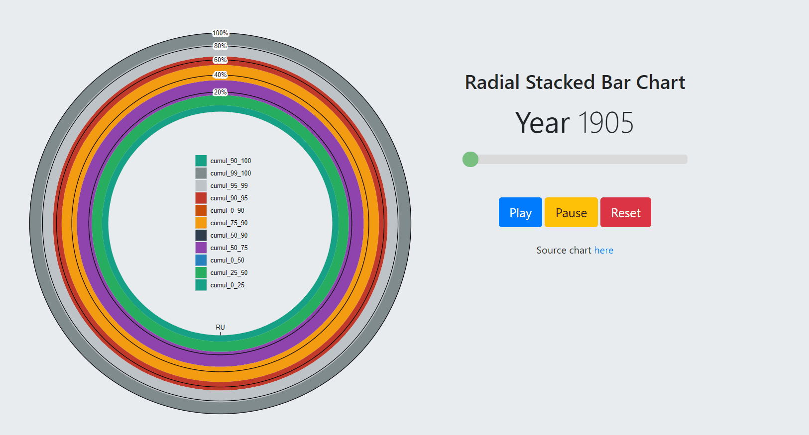
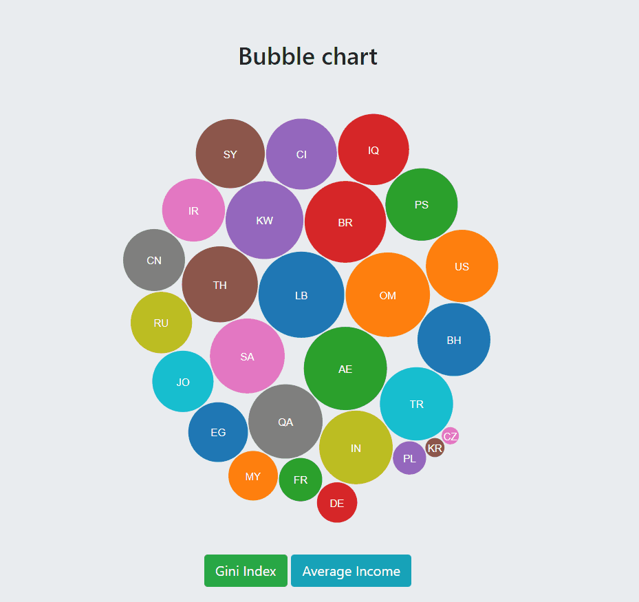
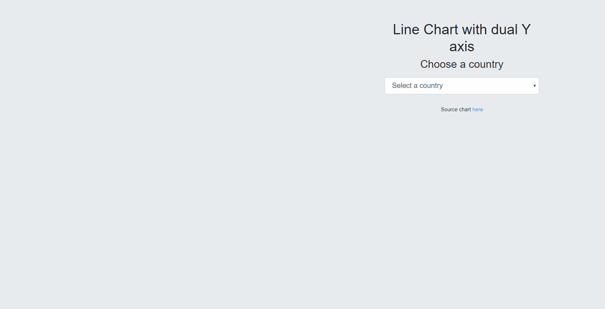
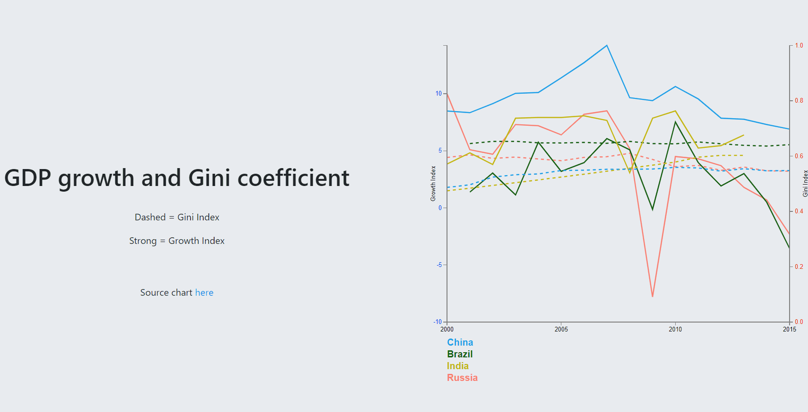

# 2019-wid

Extracts of the [World Inequality Database](https://wid.world/).

## Content

* **data/** The data folder
	* **countries.tsv** country codes (Provided)
	* **income/** income share per country (Provided)

	* **gdp_growth.tsv** Growth of BRICS Countries
	* **gini.tsv** Gini of BRICS Countries
	* **BRICS_growth_gini.csv** Merged gdp_growth and gini files

	* **income_averages.tsv** Income Average of some countries
	* **income_gini.tsv** Gini Index of some countries
	* **all_income_gini.csv** Merged income_averages and income_gini.tsv

	* **continents.csv** Countries by country code, name and continent name
	
	* **merged_gini_averageincome.csv** Merged file for last data available for each country interms of Average Income and Gini Index
	* **merged_income_quantiles.csv** Merged file for all quantiles data by adding country name and continent name
	* **merged_quantiles.csv** Merged file for all countries with discretized quantiles

	* **prep.py prep1.py prep2.py prep3.py** Added scripts for aggregation and generation of csv files

* **vendor/** vendorized D3 and Bootstrap libraries

* **viz/** Visualisations

## Visualisations

 * **Radial Stacked Bar Chart**

 * **Bubble Chart**
 

 * **Dual Y Axis Average Income Gini**
 

 * **Dual Y Axis Growth BRICS Gini**
 

## Data structure

Income data table are given per country.
The attributes present in the tables are:

* **year** the year for the data
* **low** the lower bound of the population quantile (from 0. to 1.)
* **high** the upper bound of the population quantile (from 0. to 1.)
* **width** the width of the quntile (high-low)
* **share** the share of the total income captured by this [low, high] quantile
* **cumul** the cumulative share of the quantiles, i.e. the share of [0., high]

## Slides

The slides for the presentation are available [here](http://bit.ly/SlidesInfoVis)

## Project report

The project report is available [here](https://github.com/Omaroid/InfoVisWorldInequality/blob/master/Project_Info_Visualization_Report.pdf)

## How to run ?

**$ git clone https://github.com/Omaroid/InfoVisWorldInequality.git**
  
**$ cd ./InfoVisWorldInequality**  
  
**$ ls**  
  
*Mode	LastWriteTime	Length	Name* 
   
d-----	06/02/2020	22:57	-	data  
d-----	05/02/2020	20:52	-	vendor  
d-----	06/02/2020	22:40	-	viz  
-a----	07/02/2020	11:27	346945	BubbleChartAvgIncomeGini.gif  
-a----	07/02/2020	12:38	93859	Project_Info_Visualization_Report.pdf  
-a----	07/02/2020	01:49	1028410	RadialStackedBar.gif  
-a----	07/02/2020	12:39	2438	README.md  
-a----	07/02/2020	11:26	270676	TwoAxisAvgIncomeGini.gif  
-a----	07/02/2020	11:24	150306	TwoAxisBRICSGini.gif  

**$ python(3) -m http.server**

Serving HTTP on 0.0.0.0 port 8000 (http://0.0.0.0:8000/) ...  
  
You can observe the result by pointing a browser to http://localhost:8000/viz/.
